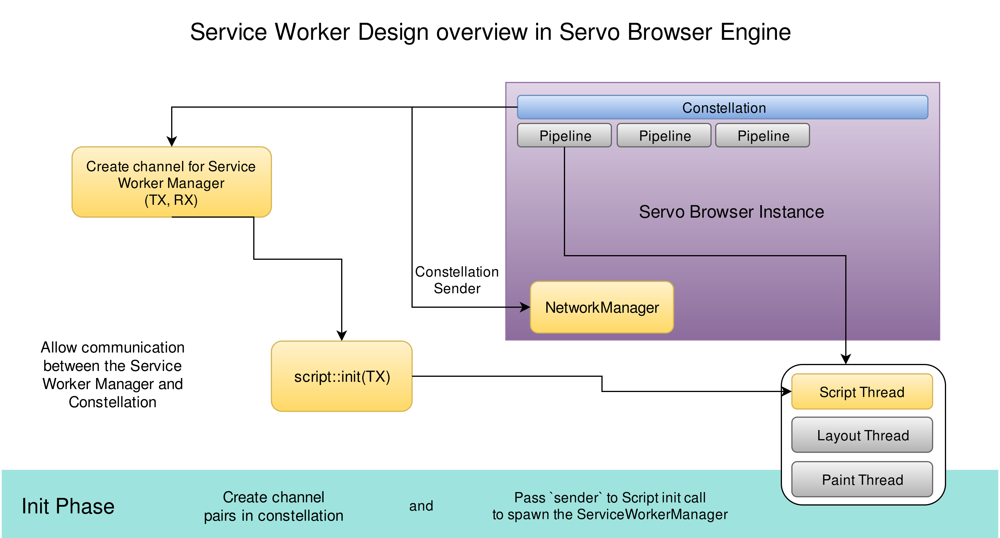
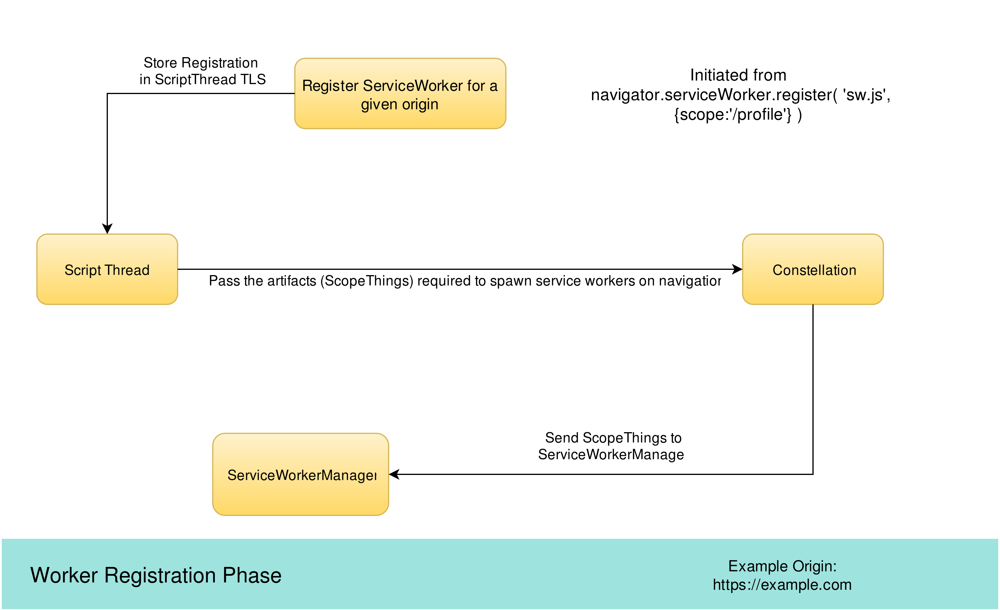
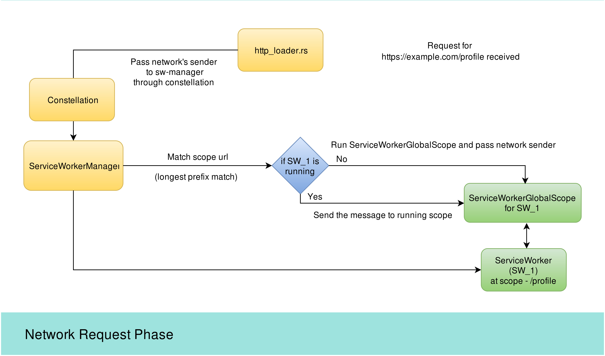

After a lot of redesign along with helpful guidance from [Josh](https://github.com/jdm) and awesome people at [Servo](https://github.com/servo/servo) we finally have a working implementation of [Service Workers](https://developer.mozilla.org/en-US/docs/Web/API/Service_Worker_API) (hereby mentioned as SW) capable enough to monitor network requests made from different origins and optionally send back custom responses on a registered origin.

This post will give an overview of the current implementation of SW's in Servo. Please note that the codebase in future is likely to face several changes, due to dependency over several features such as the Fetch Api [Tracking Issue](https://github.com/servo/servo/issues/11894) whose implementation is in progress and the Promise API [Tracking Issue](https://github.com/servo/servo/issues/4282). I also maintain a [repo](http://github.com/creativcoder/gsoc16) keeping track and notes for SW implementation.

To get a basic idea of what Service Workers are; refer to my [previous](http://creativcoder.xyz/post/service-workers-on-web/) blog post.

Before we talk about them, its helpful to mention some key concepts in Servo's architecture.
This only covers topics in a way that is in interest to SW's implementation. To get a broad overview of Servo's architecture refer, to the [Wiki](https://github.com/servo/servo/wiki/Design) or my [blog post](http://creativcoder.xyz/post/post-community-bonding-gsoc-servo/).

A constellation is a co-ordinator of various pipelines along with other entities such as the windowing system and the resource manager in Servo browser.
A pipeline in Servo is an abstraction of a Script Thread, Layout Thread and a Paint Thread (basically a page which is in process of getting parsed and rendered to a window).
We'll only focus on Script Thread here.
The Script Thread is the one that holds the DOM for a document loaded in window and handles execution of javascript in page.

Service workers are designed so as not to depend on any context/document and so they must be at a higher level in the abstraction hierarchy than the Script Thread. They can listen to network requests global wide. As such a service worker manager (hereby mentioned as SWM) thread was devised to manage different service worker registrations at different origins. The idea is to have a single instance manager that can store information of all registered SW's and can listen to network requests, activation or timeouts of any of the SW's.

* The init phase:

The constellation thread is the one that's created before any of the above mentioned threads. So it creates the required channels (here channel means creating a sender receiver pair for inter-thread communication) for SWM and passes the SWM's sender when the constellation creates the script thread which spawns the SWM thread. We also create a channel for the resource thread to communicate with constellation.

* The registration phase:

Lets take an example of a url `https://example.com` where we register a SW over the scope: `/profile`.
From the implemented DOM interfaces we register a Service Worker by calling `navigator.serviceWorker.register('sw.js', {scope: '/profile'});` which returns a registration object. This registration object is then stored in the current ScriptThread's thread local storage. At this point the worker does not start controlling pages or listening to events; instead it forwards the required attributes to the SWM, which handles the initialization of ServiceWorkerGlobalScopes upon url navigations.

* The network phase:

When the browser is navigated to the url `https://example.com/profile` where the SW was registered The `http_loader`, sends a sender to the SWM, and asks whether the current load url has a running service worker that may have a custom response. Here the SWM, forwards the network's sender, to the running ServiceWorkerGlobalScope's event loop, which then is able to reply with any custom response that is cached in.

Note : This is still a WIP post, and there will be additions.
